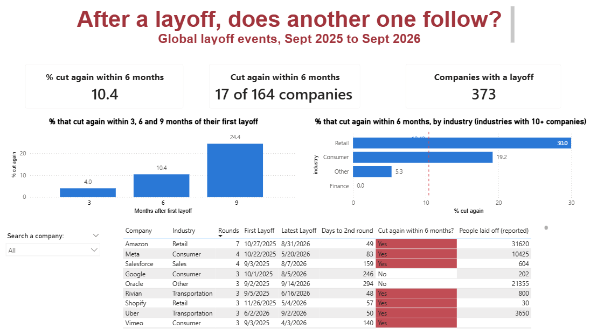
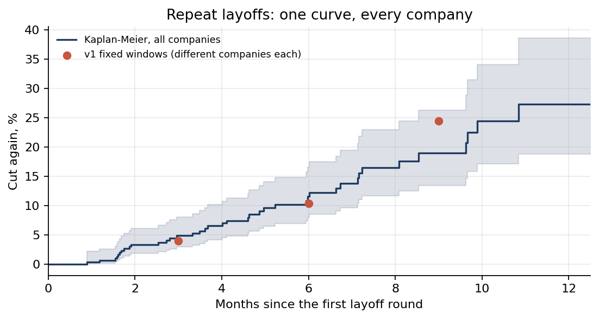

# After a layoff, does another one follow?

**About 1 in 10 companies that had a layoff cut again within 6 months** (17 of 164), based on
442 global layoff announcements from September 2025 to September 2026. SQL analysis in SQLite,
dashboard in Power BI.



## Why this question

Companies already know why they lay people off, so a chart of "who cut how many" tells them
nothing new. This project is for the people on the other side of the decision:

- **Employees** at a company that just announced a layoff: is another round likely?
- **Job seekers** deciding whether to join a company that recently cut.
- **Lenders and investors**, for whom repeated cuts can be an early warning sign.

Companies don't publish "we will probably cut again", so the repeat rate is information none of
these people can get from the company itself.

## Findings

| Within ... of the first layoff | Companies followed | Cut again | Share |
|---|---|---|---|
| 3 months | 276 | 11 | 4.0% |
| **6 months** | **164** | **17** | **10.4%** |
| 9 months | 90 | 22 | 24.4% |

- **Headline: 10.4% cut again within 6 months.** Every company in this figure had its first
  layoff at least 6 months before the data ends, so each had the same time to cut again.
- **When a second round came, most came within 6 months.** Of the 39 companies with two or more
  rounds, 14 cut again within 3 months, 11 within 3 to 6 months, 10 within 6 to 9 months, and 4
  after that.
- **By industry** (only industries with 10+ eligible companies): Retail 3 of 10, Consumer 5 of 26,
  Other 1 of 19, Finance 0 of 20. These groups are small; one company more or less moves a rate
  by several points, so treat them as descriptive, not as evidence one industry is riskier.
- The 3/6/9-month rows use different groups of companies (fewer can be followed for longer), so
  the rise from 4% to 24% mixes more time with a different set of companies.

## v2: the same question as a survival analysis

[`notebooks/repeat_risk.ipynb`](notebooks/repeat_risk.ipynb) keeps every rule above (14-day rounds, name merges) and reproduces queries 04 and 07 exactly in Python, then goes further. Outputs are aggregates only; the raw data stays private.

- **Closed companies can't cut again.** 12 of the 164 companies in the headline laid off 100% of staff in their first round. Among companies still operating, **17 of 152 (11.2%) cut again within 6 months**, with a 95% interval of **7.1% to 17.2%**. "About 1 in 10" is the right precision.
- **One curve from every company.** A Kaplan-Meier estimate follows all 330 operating companies until their second round or the end of the data, instead of only those old enough for a fixed window. It gives 4.8% by 3 months, **10.2% by 6 months** (6.9% to 14.8%) and 18.9% by 9 months. The fixed-window 24.4% at 9 months came from the 90 earliest companies only.
- **The risk doesn't fade.** After the first month (near zero by construction of the 14-day rule), roughly 1.5% to 3% of companies that have not yet cut again do so each month, through month 10.
- **The round rule is not driving anything.** The 6-month estimate is 10.2% at 7 and 14 days and 9.9% at 30. Only 60 and 90 days lower it, by merging real second rounds.
- **Who repeats?** Companies whose first cut was under 10% of staff repeated most often (16.3% by 6 months, against 6.0% and 4.0% after deeper cuts), but the evidence is weak (p = 0.08). Headcount and US location show no detectable effect in a Cox model.
- **Industries, shrunk toward the overall rate** with a beta-binomial model: Retail's 3 of 9 becomes 15.6%, Finance's 0 of 18 becomes 6.9%. The differences are mostly sample size.



## How it's built

```
layoffs_global_12mo.csv  ->  sql/load_layoffs.py  ->  sql/layoffs.db (SQLite)
                                                        |
                          sql/queries/01 ... 08.sql  <--+
                                                        |
                          sql/exports/*.csv  ->  Power BI dashboard
```

| Query | Question it answers |
|---|---|
| `01_company_summary` | How many layoff events does each company have? |
| `02_event_gaps` | How many days since that company's previous event? (`LAG` window function) |
| `03_round_numbers` | Which events are really separate layoff decisions? (running `SUM ... OVER`) |
| `04_repeat_rate` | What share cut again within 6 months? (the headline) |
| `05_company_lookup` | One row per company: rounds, dates, cut again yes/no |
| `06_industry_rates` | Repeat rate by industry, with a small-sample flag |
| `07_repeat_curve` | Repeat rate within 3, 6 and 9 months |
| `08_events_for_dashboard` | Event-level table for the dashboard |

## Key decisions

Each is written up, with the case against it, in [`docs/decisions/`](docs/decisions/).

- **Events vs rounds (0006).** The tracker sometimes records one layoff once per country: PayPal
  appears 4 times in 6 days (Ireland, India, US, Israel). Events from the same company within
  14 days of the previous one count as one round. A 90-day rule was tested and rejected: it
  chained separate rounds together (Meta's 5 events collapsed into 1). The headline is the same
  at 14 and 30 days (10.4%) and lower at 90 days, because 90 days merges real second rounds.
- **A fixed 6-month window (0007).** Counting any second round before the data ends would give
  early companies 12 months to repeat and later ones 6. A fixed window gives every company the
  same time. The difference is large: about 1 in 10 versus about 1 in 5.
- **Censoring at both ends.** Companies whose first layoff was recent haven't had time to cut
  again, so they are excluded from the rate (and shown as "Too recent to tell" in the lookup).
  Layoffs before September 2025 aren't in the data, so a company's "first" round here may not be
  its first ever. The findings are about companies that had a layoff in this period.
- **Missing values kept as missing.** 150 of 442 events have no reported headcount and 204 no
  reported percentage. They are stored as `NULL`, never 0, and headcount totals are minimums.
- **Name variants merged (0008).** "Tiktok"/"TikTok" and "theGist"/"The Gist" were the same
  companies. SQLite had treated them as different; Power BI's relationship check caught it. Fixed
  in the loader, and the headline moved from 10.3% to 10.4%.

## Limits

- Only about 40 companies had a second round, so the analysis supports "repeat layoffs are
  fairly common", not fine-grained comparisons.
- There's no outcome data: this shows repeat cuts are common, not that they predict a company
  failing.
- layoffs.fyi leans toward tech companies and companies that make the news.
- The window is deliberately the last 12 months: this is a study of company behaviour in this
  period, not over companies' whole history.

## Data source and credit

Layoff data from **[layoffs.fyi](https://layoffs.fyi)**, which asks for attribution. Bulk download and copy were disabled on the site's table, so the data was
transcribed from the site's own printed view of the table (September 2025 to September 2026) and
checked row by row. Any errors in transcription are mine, not layoffs.fyi's.

## What's in this repo

The raw layoff data is **not** included, out of respect for layoffs.fyi, which disables bulk
download of its table. For the same reason the database, the event-level and company-level
exports, and the Power BI file (which stores its imported data inside it) are kept private. The
screenshot above shows the dashboard.

Included: the loading script, all eight SQL queries, the two summary tables
(`sql/exports/industry_rates.csv`, `sql/exports/repeat_curve.csv`) and every decision write-up.

## Run it yourself

1. Get the layoffs.fyi data for September 2025 to September 2026 and save it as
   `layoffs_global_12mo.csv` with the columns
   `company,location_hq,country,num_laid_off,date,pct_workforce,industry`.
2. `python sql/load_layoffs.py` builds `sql/layoffs.db`.
3. Open the database in [DB Browser for SQLite](https://sqlitebrowser.org) and run the files in
   `sql/queries/`.
